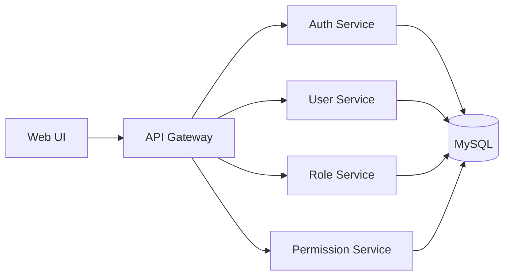

# gonoweb

This is a monolithic Go web application scaffold that uses Gin, GORM, and Casbin for the backend, and React.js and Next.js for the frontend.

## 高层设计

## 低层设计

## Backend

- [Gin](https://github.com/gin-gonic/gin)
- [Gorm](https://github.com/go-gorm/gorm)
- [Casbin](https://github.com/casbin/casbin)

## Frontend

- [React](https://github.com/facebook/react)
- [Nextjs](https://nextjs.org/)
- [HeroUI](https://www.heroui.com/docs/guide/introduction)

